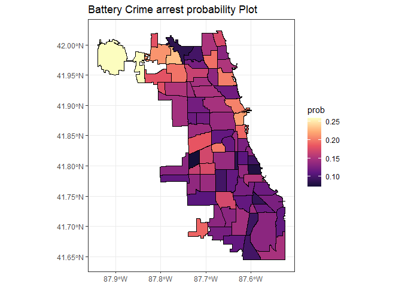
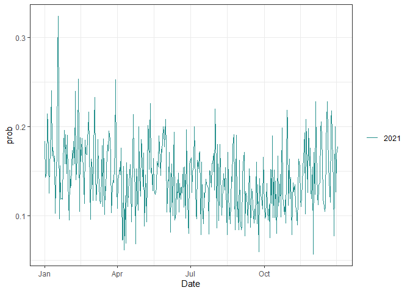
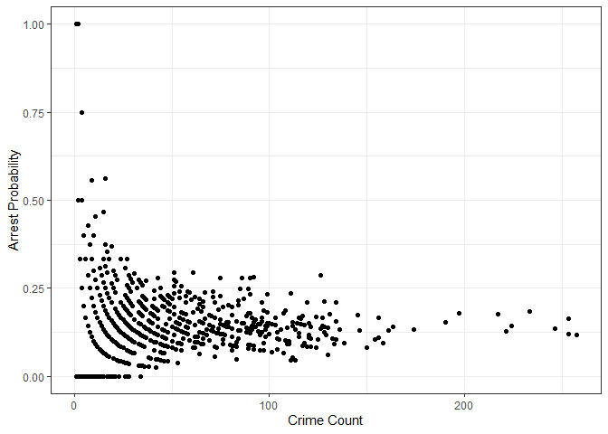

Chicago Battery Crime Report
================
Yi Ma, Haoxuan Sun, Chenshuo Pan, Yuning Wang
2022-12-16

**Introduction:**  
As a UW-Madison student, Chicago is our first choice for holidays and
weekends,  
so safety issues are worth our research. Our project aims to help people
to  
understand the crime rate in Chicago and then plan their trips more
wisely by  
analyzing the crime statistics in Chicago.  
In popular views, people commonly believe that the southern part of
Chicago is  
more dangerous than the northern part. However, we think this view might
be biased.  
This paper investigates public security based on crime rate with
different factors  
such as location, date, crime type, etc. We use arrest probability as a
standard  
to measure security in Chicago. We assume arrest probability serves as a
deterrent,  
and a higher arrest rate results in a lower crime count. However, we
found  
no association between the rate of change for crime count and the rate
of change  
for arrest probability by month for each region.  

**Data:**  

    ##    X       ID Case.Number       Date                 Block IUCR Primary.Type
    ## 1  1 12571973    JE482457 2021-12-19     042XX S MOZART ST 0460      BATTERY
    ## 2  5 12541139    JE445494 2021-11-14       034XX W 38TH ST 0486      BATTERY
    ## 3  8 12541098    JE444580 2021-11-14    072XX S HAMLIN AVE 0486      BATTERY
    ## 4 12 12432560    JE312616 2021-07-24  079XX S EAST END AVE 0486      BATTERY
    ## 5 14 12541082    JE445347 2021-11-14   118XX S LA SALLE ST 0486      BATTERY
    ## 6 40 12341826    JE201350 2021-04-16 034XX W FRANKLIN BLVD 0460      BATTERY
    ##               Description                   Location.Description Arrest
    ## 1                  SIMPLE                               SIDEWALK   true
    ## 2 DOMESTIC BATTERY SIMPLE                              RESIDENCE  false
    ## 3 DOMESTIC BATTERY SIMPLE                              RESIDENCE  false
    ## 4 DOMESTIC BATTERY SIMPLE PARKING LOT / GARAGE (NON RESIDENTIAL)   true
    ## 5 DOMESTIC BATTERY SIMPLE                              RESIDENCE   true
    ## 6                  SIMPLE                               SIDEWALK  false
    ##   Domestic Beat District Ward Community.Area FBI.Code X.Coordinate Y.Coordinate
    ## 1     true  921        9   15             58      08B      1158067      1876425
    ## 2     true  911        9   12             58      08B      1154073      1879187
    ## 3     true  833        8   13             65      08B      1152286      1856407
    ## 4     true  414        4    8             46      08B      1189026      1852775
    ## 5     true  522        5   34             53      08B      1177388      1826451
    ## 6    false 1123       11   27             23      08B      1153459      1903123
    ##   Year             Updated.On Latitude Longitude                      Location
    ## 1 2021 09/12/2022 04:45:45 PM 41.81666 -87.69569  (41.81665685, -87.695688608)
    ## 2 2021 11/21/2021 03:48:03 PM 41.82432 -87.71027 (41.824316537, -87.710266215)
    ## 3 2021 11/21/2021 03:48:03 PM 41.76184 -87.71742 (41.761840209, -87.717420956)
    ## 4 2021 08/12/2021 04:59:32 PM 41.75107 -87.58288 (41.751072904, -87.582881895)
    ## 5 2021 11/21/2021 03:48:03 PM 41.67911 -87.62632  (41.679106927, -87.62632107)
    ## 6 2021 04/23/2021 04:51:47 PM 41.89001 -87.71188 (41.890011876, -87.711883222)
    ##   month
    ## 1    12
    ## 2    11
    ## 3    11
    ## 4     7
    ## 5    11
    ## 6     4

Our raw data is from the Chicago city government  
(<https://data.cityofchicago.org/Public-Safety/Crimes-2001-to-Present/ijzp-q8t2>).  
It contains the crime incidents of murder in Chicago From 2001 to the
present.  
The original data contains 7666107 rows and 22 columns. Each row in the
dataset  
represents a reported crime happening in Chicago. Since the original
dataset  
contains too many rows, we only selected the data of 2021 for the
timeliness,  
and we selected several key columns of data, such as crime type,
description,  
domestic, community area, etc. The dataset has some missing values in
the column  
Longitude and Latitude. Since the official conceals the detailed block
number  
due to privacy issues, it is impossible to impute the missing data.
However,  
we still want to keep the rows with the missing locations since they may
contain  
useful Date and Type information. We focus on the battery crime rate in
Chicago  
since the number of reported battery crimes is the second highest among
all  
types of crimes in the dataset. And according to the sentencing
guidelines of  
Illinois, this type of crime should be arrested legally (Sentencing
guidelines  
for Class A misdemeanors can be found under Illinois statute 730 ILCS
5/5-4.5-55.).  
Therefore, it is reasonable to use this probability as an indicator of
safety in Chicago.  

**Method/Procedure:**  
At first, we used Logistic Regression to predict the probability of
battery crime  
arrest rate with explanatory variables of the community area, month,
crime  
description, and domestic status to predict the arrest rate. Considering
that  
our responsive variable, “Arrest”, is a binary variable (arrest or not),
logistic  
regression is a desirable method. In addition, logistic regression is
also  
convenient for us to calculate the odds ratio of different conditions.
In order  
to help us better observe the data in different scopes. We visualize the
arrest  
probability and crime count for each community area and each month using
a  
shiny app. It allows us to select certain regions and months and then
create the  
map with probability statistics. The shiny app will return an arrest
probability  
and two plots. Tuning community area, month, crime description, and
domestic  
status will calculate the arrest rate under selected conditions. For
the  
time series plot, users can select from Year, Month, and Week to
visualize the  
trend of arrest rate within that period. In the map plot, users can show
the  
arrest rate of all community areas within a range of two months. We can
see the  
arrest rate and crime count change when the month changes given other
factors stay the same.  

To see if arrest rate and crime count are correlated, we also compute
the  
difference between the arrest probability and the number of crimes for
the  
concurrent month and the following month in order to see if the positive
change  
in arrest rate can result in a decrease in the number of crimes. We then
use  
linear regression to see how those changes are correlated in order to
determine  
if the arrest rate can predict future crime numbers.  

**Result:**  
The LRT for logistic regression shows that all the features are
significant.  
Therefore, we can conclude that at least some of the levels in our
categorical  
variables can affect the probability of arrest. We are able to apply our
model  
to estimate the arrest rate in Chicago.  
For example, when the community area is 69, given other factors are
constant,  
the odds of being arrested are 0.664 times of the community area is 1.
When the  
time is April, given other factors are constant, the odds of being
arrested are  
0.025 times of month in January.  

<!-- -->

<!-- -->

In our shiny app, we found at the beginning  
and the end of the year, there was an increase in the crime number and
arrest  
probability. There exists a decreasing trend for battery arrest rate
from the  
Chicago northwest community area to the southeast community area.
Besides these  
two points, the battery crime arrest rate is associated with domestic
types;  
The average probability of domestic battery arrest rate is 10% higher
than the  
probability of non-domestic battery arrest rate.  
It is worth noting that we observe large fluctuations in the number of
crimes  
during different months of the year.  
So we investigated if arrest probability is associated with crime
count,  
we grouped the data by month and community area. We fitted a linear
regression  
with the rate of change in crime count as a response and the rate of
change in  
arrest probability as an explanatory variable.  
The summary table shows a weak significance for rate change in arrest
probability  
as the p-value is between 0.05 to 0.1. The coefficient is -0.041, it
suggests  
that as one unit increases rate change in arrest probability, the number
of  
crimes will decrease 0.041 units.  
However, we found no strong association between them, as the scatter
plot  
between the two rates of change has a fairly random pattern, and the
model has  
minimal R-squared values(0.0027). Thus, the arrest rate cannot predict
future  
crime counts in the short term accurately from our analysis so far.  
  

    ## `summarise()` has grouped output by 'month'. You can override using the
    ## `.groups` argument.

    ## # A tibble: 923 × 5
    ## # Groups:   month [12]
    ##    month Community.Area crime_count arrest_num arrest_prob
    ##    <dbl>          <int>       <int>      <dbl>       <dbl>
    ##  1     1              1          48          9       0.188
    ##  2     1              2          34          9       0.265
    ##  3     1              3          41          5       0.122
    ##  4     1              4          24          8       0.333
    ##  5     1              5           6          1       0.167
    ##  6     1              6          24          4       0.167
    ##  7     1              7          11          0       0    
    ##  8     1              8          79         16       0.203
    ##  9     1             10          11          2       0.182
    ## 10     1             11          10          2       0.2  
    ## # … with 913 more rows

    ## `mutate_if()` ignored the following grouping variables:
    ## • Column `month`

<!-- -->

    ## 
    ## Call:
    ## lm(formula = RateOfChange_crime_count ~ prob_change, data = time2)
    ## 
    ## Residuals:
    ##    Min     1Q Median     3Q    Max 
    ## -97.86 -26.56  -7.71  12.80 589.64 
    ## 
    ## Coefficients:
    ##             Estimate Std. Error t value Pr(>|t|)    
    ## (Intercept) 10.36390    1.89850   5.459 6.34e-08 ***
    ## prob_change -0.04053    0.02254  -1.798   0.0725 .  
    ## ---
    ## Signif. codes:  0 '***' 0.001 '**' 0.01 '*' 0.05 '.' 0.1 ' ' 1
    ## 
    ## Residual standard error: 54.17 on 822 degrees of freedom
    ##   (因为不存在，99个观察量被删除了)
    ## Multiple R-squared:  0.003918,   Adjusted R-squared:  0.002707 
    ## F-statistic: 3.234 on 1 and 822 DF,  p-value: 0.07251

    ## Analysis of Deviance Table (Type II tests)
    ## 
    ## Response: as.factor(Arrest)
    ##                           LR Chisq Df Pr(>Chisq)    
    ## Domestic                     28.96  1  7.376e-08 ***
    ## as.factor(Community.Area)   347.43 76  < 2.2e-16 ***
    ## as.factor(month)             63.94 11  1.702e-09 ***
    ## as.factor(Description)     1650.53 25  < 2.2e-16 ***
    ## ---
    ## Signif. codes:  0 '***' 0.001 '**' 0.01 '*' 0.05 '.' 0.1 ' ' 1

**Conclusion:**  
From our analysis, we generated a logistic regression model that can
predict the  
arrest rate based on community area, month, crime description, and
domestic status.  
For example, according to our model, the crimes involving minor injuries
to  
police officers had the highest arrest probability of 0.948 in the
O’hare area in January.  
  
However, we fail to conclude there’s a strong correlation between the
rate of  
change in crime number and the rate of change in arrest probability,
which  
indicates higher arrest rate fails to result in lower crime counts.  
Weakness: Our data set only records the cases reported in Chicago in
2021, so  
there may be cases that occurred but were not recorded in the data
set.  
Furthermore, police may not arrest a suspect due to insufficient
criminal  
evidence. The changes in policy may also affect the crime counts. And
the  
increase in arrest rate may not affect the number of crimes immediately
for  
the following month. Those factors may reduce the accuracy of our
analysis.  
  
**Future Analysis:**  
We can use our model to predict the arrest rate for battery crime to
determine  
the security concern for each community region in further years if
months and  
specific types of crime are given. At the same time, we can also study
whether  
the arrest rate can be a deterrent to crime when the time span is
extended.  

Github link:\[<https://github.com/cspan6/STAT-433-assignment>\]
