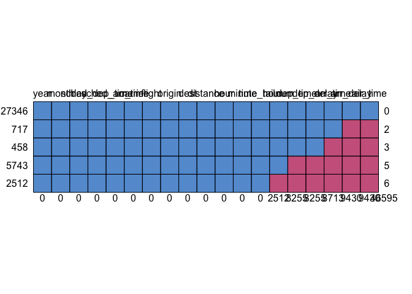
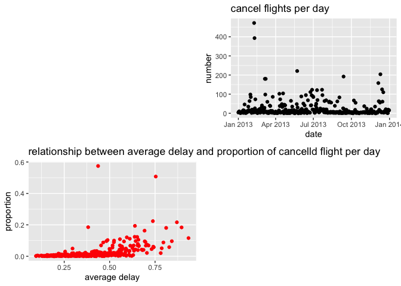

421-assignment1
================
Chenshuo Pan
2022-09-21

``` r
library(dplyr)
```

    ## Warning: replacing previous import 'lifecycle::last_warnings' by
    ## 'rlang::last_warnings' when loading 'pillar'

    ## 
    ## Attaching package: 'dplyr'

    ## The following objects are masked from 'package:stats':
    ## 
    ##     filter, lag

    ## The following objects are masked from 'package:base':
    ## 
    ##     intersect, setdiff, setequal, union

``` r
library(tidyverse)
```

    ## ── Attaching packages ─────────────────────────────────────── tidyverse 1.3.1 ──

    ## ✓ ggplot2 3.3.6     ✓ purrr   0.3.4
    ## ✓ tibble  3.1.6     ✓ stringr 1.4.1
    ## ✓ tidyr   1.1.4     ✓ forcats 0.5.2
    ## ✓ readr   2.1.2

    ## Warning: package 'readr' was built under R version 4.0.5

    ## ── Conflicts ────────────────────────────────────────── tidyverse_conflicts() ──
    ## x dplyr::filter() masks stats::filter()
    ## x dplyr::lag()    masks stats::lag()

``` r
# install.packages("nycflights13")
library(nycflights13)
library(ggplot2)
library(mice)
```

    ## 
    ## Attaching package: 'mice'

    ## The following object is masked from 'package:stats':
    ## 
    ##     filter

    ## The following objects are masked from 'package:base':
    ## 
    ##     cbind, rbind

``` r
library(stringr)
library(tsibbledata)
library(tsibble)
```

    ## 
    ## Attaching package: 'tsibble'

    ## The following objects are masked from 'package:base':
    ## 
    ##     intersect, setdiff, union

``` r
library(lubridate)
```

    ## 
    ## Attaching package: 'lubridate'

    ## The following object is masked from 'package:tsibble':
    ## 
    ##     interval

    ## The following objects are masked from 'package:base':
    ## 
    ##     date, intersect, setdiff, union

``` r
library(ggpubr)
```

``` r
flights = nycflights13::flights
```

\#1. How many flights have a missing dep\_time? What other variables are
missing? What might these rows represent?

``` r
flights%>%
  filter(is.na(dep_time))%>%
  summarize(n = n())
```

    ## # A tibble: 1 × 1
    ##       n
    ##   <int>
    ## 1  8255

**8255 flights have a missing
dep\_time**

``` r
#md.pattern will help us count the number of missing values in each column
md.pattern(flights)
```

<!-- -->

    ##        year month day sched_dep_time sched_arr_time carrier flight origin dest
    ## 327346    1     1   1              1              1       1      1      1    1
    ## 717       1     1   1              1              1       1      1      1    1
    ## 458       1     1   1              1              1       1      1      1    1
    ## 5743      1     1   1              1              1       1      1      1    1
    ## 2512      1     1   1              1              1       1      1      1    1
    ##           0     0   0              0              0       0      0      0    0
    ##        distance hour minute time_hour tailnum dep_time dep_delay arr_time
    ## 327346        1    1      1         1       1        1         1        1
    ## 717           1    1      1         1       1        1         1        1
    ## 458           1    1      1         1       1        1         1        0
    ## 5743          1    1      1         1       1        0         0        0
    ## 2512          1    1      1         1       0        0         0        0
    ##               0    0      0         0    2512     8255      8255     8713
    ##        arr_delay air_time      
    ## 327346         1        1     0
    ## 717            0        0     2
    ## 458            0        0     3
    ## 5743           0        0     5
    ## 2512           0        0     6
    ##             9430     9430 46595

**For each missing dep\_time line, dep\_delay,arr\_time, arr\_delay are
all missing.**

**These rows represent the flights been cancelled.Because these lines
are missing all arrival/departure** **times and expected
arrival/departure times at the time.**

\#2.

``` r
convertTime <- function(data,time){
  colomn <- data$time
  time_in_minute <- column%%100 + (column%/%100)*60
  return(time_in_minute)
}
```

Currently dep\_time and sched\_dep\_time are convenient to look at, but
hard to compute with because they’re not really continuous numbers.
Convert them to a more convenient representation of number of minutes
since midnight.

``` r
flight = flights
flight%>%
  mutate(dep_time = dep_time%%100 + (dep_time%/%100)*60,
         sched_dep_time = sched_dep_time%%100 + (sched_dep_time%/%100)*60)
```

    ## # A tibble: 336,776 × 19
    ##     year month   day dep_time sched_de…¹ dep_d…² arr_t…³ sched…⁴ arr_d…⁵ carrier
    ##    <int> <int> <int>    <dbl>      <dbl>   <dbl>   <int>   <int>   <dbl> <chr>  
    ##  1  2013     1     1      317        315       2     830     819      11 UA     
    ##  2  2013     1     1      333        329       4     850     830      20 UA     
    ##  3  2013     1     1      342        340       2     923     850      33 AA     
    ##  4  2013     1     1      344        345      -1    1004    1022     -18 B6     
    ##  5  2013     1     1      354        360      -6     812     837     -25 DL     
    ##  6  2013     1     1      354        358      -4     740     728      12 UA     
    ##  7  2013     1     1      355        360      -5     913     854      19 B6     
    ##  8  2013     1     1      357        360      -3     709     723     -14 EV     
    ##  9  2013     1     1      357        360      -3     838     846      -8 B6     
    ## 10  2013     1     1      358        360      -2     753     745       8 AA     
    ## # … with 336,766 more rows, 9 more variables: flight <int>, tailnum <chr>,
    ## #   origin <chr>, dest <chr>, air_time <dbl>, distance <dbl>, hour <dbl>,
    ## #   minute <dbl>, time_hour <dttm>, and abbreviated variable names
    ## #   ¹​sched_dep_time, ²​dep_delay, ³​arr_time, ⁴​sched_arr_time, ⁵​arr_delay

3.Look at the number of canceled flights per day. Is there a pattern? Is
the proportion of canceled flights related to the average delay? Use
multiple dyplr operations, all on one line, concluding with
ggplot(aes(x= ,y=)) + geom\_point()

``` r
# #different line
# cancelled <- flights %>% 
#   filter(is.na(dep_delay), is.na(arr_delay))
# 
# 
# cancelled_perday<-cancelled%>%group_by(year,month,day)%>%summarize(cancel_number=n())
# 
# cancelled_perday%>%ggplot(aes(x= ,y=)) + geom_point()
# 
# per_day = flights%>%group_by(year,month,day)%>%summarize(flights_perday = n())
# 
# 
# 
# combined_per_day<-right_join(cancelled_perday,per_day)%>%mutate(proportion = cancel_number/flights_perday)
# 
# delay_perday <-flights%>%filter(!is.na(arr_delay))%>%
#   mutate(on_time = if_else(condition = arr_delay<0,
#                            true = T,
#                            false = F,
#                            missing = F))%>%
#   group_by(year,month,day)%>%summarize(average_delay = mean(on_time))
# 
# full_combined<-right_join(combined_per_day,delay_perday)
```

``` r
#one line
flight%>%filter(is.na(dep_delay), is.na(arr_delay))%>%
  group_by(year,month,day)%>%summarize(cancel_number=n())%>%
  #above codes count how many flights cancelled per day
  #Below codes count how many flights per day and combine these two data , the create a new column which
  #calculate the proportion
  right_join(flights%>%group_by(year,month,day)%>%summarize(flights_perday = n()))%>%
  mutate(proportion = cancel_number/flights_perday)%>%
  right_join(flights%>%filter(!is.na(arr_delay))%>%
  #Set the conditions(same as what we do in class) to filter the number of delayed flights per day and the total number of flights to get the average delay
  mutate(on_time = if_else(condition = arr_delay>0,
                           true = T,
                           false = F,
                           missing = F))%>%
  group_by(year,month,day)%>%
    summarize(average_delay = mean(on_time)))%>%
  replace(.,is.na(.),0)%>%
  arrange(year,month,day)%>%
  #Convert to a time series suitable for the x-axis
  mutate(date = ymd(str_c(year,month,day,sep = "-")))%>%
  as_tsibble(.,index = date)%>%
  ggarrange((ggplot(.) + geom_point(aes(x=date ,y=cancel_number))+ggtitle("cancel flights per day")+xlab("date")+ylab('number')),
            (ggplot(.)+geom_point(aes(x = average_delay, y = proportion),color="red")+ggtitle("relationship between average delay and proportion of cancelld flight per day ")+xlab("average delay")+ylab("proportion")),ncol = 2,nrow = 2)
```

<!-- -->

``` r
  # ggplot() + geom_point(aes(x=date ,y=cancel_number))+ 
  # geom_point(aes(x = date,y = proportion),color = "red")+
  # geom_point(aes(x = date,y = average_delay),color = "blue")+ggtitle("average delay,proportion,cancel number of each date ")
```

**No apparent pattern in the number of flights cancelled per day**

**Through observation, it is not difficult to find that when the average
delay is low, the proportion value is also very low, and it rises as the
average delay increases. Perhaps there is a curve that can illustrate
the relationship between the two**
