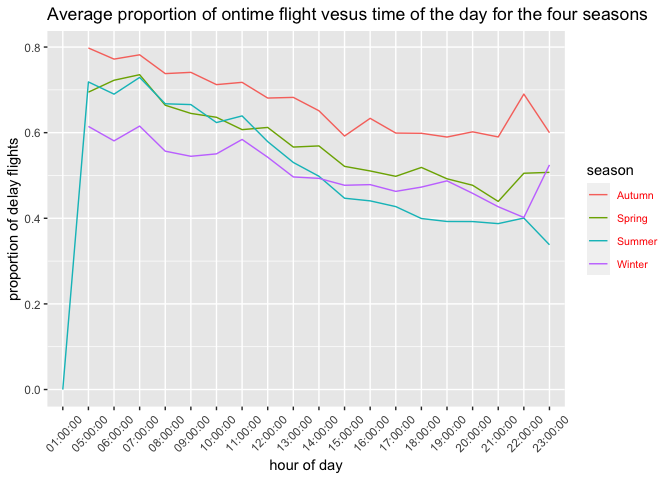
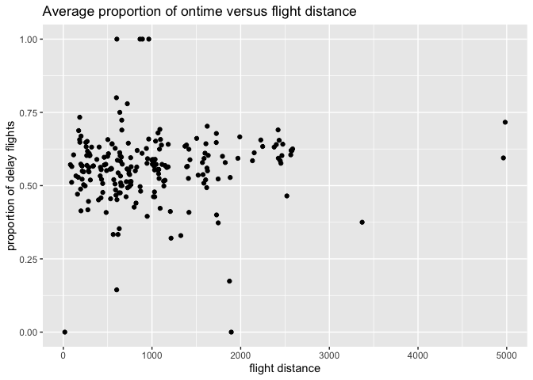

assignment2-433
================
Chenshuo Pan
2022-10-07

**This file analyzes the delays at New York airports at different times
of the day, considering that the number of flights in each period is
different, so here I use the ratio as a measure. The delay data is
analyzed in combination with factors such as seasons, different
airports, airlines, etc., and some experiments are carried out based on
my own experience. In general, it is recommended to take flights in the
mornings in winter and evenings in summer, and there is not much
difference between the three airports in New York. Recommend United
Airline in airline selection, Southwest Airlines in the evening, not
Virgin America at noon.**

``` r
library(dplyr)
```

    ## Warning: replacing previous import 'lifecycle::last_warnings' by
    ## 'rlang::last_warnings' when loading 'pillar'

    ## 
    ## Attaching package: 'dplyr'

    ## The following objects are masked from 'package:stats':
    ## 
    ##     filter, lag

    ## The following objects are masked from 'package:base':
    ## 
    ##     intersect, setdiff, setequal, union

``` r
library(tidyverse)
```

    ## ── Attaching packages ─────────────────────────────────────── tidyverse 1.3.1 ──

    ## ✓ ggplot2 3.3.6     ✓ purrr   0.3.4
    ## ✓ tibble  3.1.6     ✓ stringr 1.4.1
    ## ✓ tidyr   1.1.4     ✓ forcats 0.5.2
    ## ✓ readr   2.1.2

    ## Warning: package 'readr' was built under R version 4.0.5

    ## ── Conflicts ────────────────────────────────────────── tidyverse_conflicts() ──
    ## x dplyr::filter() masks stats::filter()
    ## x dplyr::lag()    masks stats::lag()

``` r
library(ggplot2)
library(ggfortify)
```

    ## Warning: package 'ggfortify' was built under R version 4.0.5

``` r
library(pacman)
library(forecast)
```

    ## Warning: package 'forecast' was built under R version 4.0.5

    ## Registered S3 method overwritten by 'quantmod':
    ##   method            from
    ##   as.zoo.data.frame zoo

    ## Registered S3 methods overwritten by 'forecast':
    ##   method                 from     
    ##   autoplot.Arima         ggfortify
    ##   autoplot.acf           ggfortify
    ##   autoplot.ar            ggfortify
    ##   autoplot.bats          ggfortify
    ##   autoplot.decomposed.ts ggfortify
    ##   autoplot.ets           ggfortify
    ##   autoplot.forecast      ggfortify
    ##   autoplot.stl           ggfortify
    ##   autoplot.ts            ggfortify
    ##   fitted.ar              ggfortify
    ##   fortify.ts             ggfortify
    ##   residuals.ar           ggfortify

``` r
flights <-nycflights13::flights
```

``` r
flight<-flights%>%mutate(timeofday=
  flights$time_hour%>%substr(.,11,30),
  on_time = if_else(condition = arr_delay>0,
                           true = T,
                           false = F,
                           missing = F)  )
```

``` r
flight1<-flight%>%
  filter(on_time==FALSE)%>%
  group_by(timeofday)%>%
  summarize(n = n())%>%left_join(flight%>%
  group_by(timeofday)%>%
  summarize(total = n()))%>%mutate(proportion = n/total)
```

    ## Joining, by = "timeofday"

``` r
  # ggplot()+geom_histogram(aes(x = timeofday,y = n))
```

``` r
flight%>%
  group_by(timeofday)%>%
  summarize(total = n())
```

    ## # A tibble: 20 × 2
    ##    timeofday   total
    ##    <chr>       <int>
    ##  1 " 01:00:00"     1
    ##  2 " 05:00:00"  1953
    ##  3 " 06:00:00" 25951
    ##  4 " 07:00:00" 22821
    ##  5 " 08:00:00" 27242
    ##  6 " 09:00:00" 20312
    ##  7 " 10:00:00" 16708
    ##  8 " 11:00:00" 16033
    ##  9 " 12:00:00" 18181
    ## 10 " 13:00:00" 19956
    ## 11 " 14:00:00" 21706
    ## 12 " 15:00:00" 23888
    ## 13 " 16:00:00" 23002
    ## 14 " 17:00:00" 24426
    ## 15 " 18:00:00" 21783
    ## 16 " 19:00:00" 21441
    ## 17 " 20:00:00" 16739
    ## 18 " 21:00:00" 10933
    ## 19 " 22:00:00"  2639
    ## 20 " 23:00:00"  1061

**Here, I counted all the flight information in New York within a year,
and grouped them by hour. It can be seen that there is no number of
flights between 2-4am, and here I calculated the proportion of delayed
flights (including cancellations). In fact, from Looking at this
picture, we can only get a weak trend, a straight line with an
insignificant slope, and the proportion of flight delays at about 9
o’clock in the evening reaches the minimum.**

``` r
ggplot(data = flight1)+
  geom_bar(mapping = aes(x = timeofday, y = n),stat="identity")+
  geom_line(aes(x = timeofday,y = proportion*10000),group = 20,color="red")+
  theme(axis.text.x = element_text(angle = 45, hjust = 0.5, vjust = 0.5))
```

<!-- -->

``` r
# legend("topleft",legend = c("proportion"),col = c("red"))
```

``` r
flight_season1 <- flight%>%mutate(season = case_when(
  month%in%c(3,4,5)~"Spring",
  month%in%c(6,7,8)~"Summer",
  month%in%c(9,10,11)~"Autumn",
  month%in%c(12,1,2)~"Winter"))%>%group_by(timeofday,season)%>%summarize(total = n())
```

    ## `summarise()` has grouped output by 'timeofday'. You can override using the
    ## `.groups` argument.

``` r
flight_season2 <- flight%>%mutate(season = case_when(
  month%in%c(3,4,5)~"Spring",
  month%in%c(6,7,8)~"Summer",
  month%in%c(9,10,11)~"Autumn",
  month%in%c(12,1,2)~"Winter"))%>%filter(on_time ==FALSE)%>%group_by(timeofday,season)%>%summarize(n = n())
```

    ## `summarise()` has grouped output by 'timeofday'. You can override using the
    ## `.groups` argument.

``` r
flight_season <-left_join(flight_season2,flight_season1)%>%mutate(proportion = n/total)
```

    ## Joining, by = c("timeofday", "season")

``` r
flight_season%>%ggplot(aes(x = timeofday,
                           y = proportion,
                           color = season))+
  geom_line(group = flight_season$season)+
theme(axis.text.x = element_text(angle = 45, hjust = 0.5, vjust = 0.5))+
  xlab("hour of day")+
  ylab("proportion of delay flights")+theme(legend.text = element_text(size = 8, colour = "red"))+
  ggtitle("Average proportion of delays time of the day for the four seasons")
```

<!-- -->
**Here, according to the four seasons, I have drawn the proportional
curve of each time point. It can be clearly seen that the blue color is
autumn, and the flight delay ratio is always higher than that of the
other four seasons. At the same time, I noticed that before 13:00, the
flight delay rate is the lowest in winter, and after that, the delay
rate in summer is the lowest, so it is recommended to take flights in
the morning in winter, and in the afternoon and evening in summer.
Overall, all four seasons have the highest percentage of delays in the
morning, and it is not recommended to take flights in the
morning**

``` r
flight1<-flight1%>%mutate(test = ts(timeofday))
```

``` r
flight_origin1<-flight%>%filter(on_time==FALSE)%>%group_by(timeofday,origin)%>%summarize(n=n())
```

    ## `summarise()` has grouped output by 'timeofday'. You can override using the
    ## `.groups` argument.

``` r
flight_origin2<-flight%>%group_by(timeofday,origin)%>%summarize(total=n())
```

    ## `summarise()` has grouped output by 'timeofday'. You can override using the
    ## `.groups` argument.

``` r
flight_origin <-left_join(flight_origin2,flight_origin1)%>%mutate(proportion = n/total)
```

    ## Joining, by = c("timeofday", "origin")

``` r
ggplot(flight_origin)+
  geom_line(aes(x = timeofday,y = proportion),group = 1)+
  facet_grid(origin~.)+
    theme(axis.text.x = element_text(angle = 45, hjust = 0.5, vjust = 0.5))+
    xlab("hour of day")+
  ylab("proportion of delay flights")+
  ggtitle("Average proportion of delays per hour of the day at 3 New York airports")
```

<!-- -->
**Overall, the difference between the three airports is not obvious.
Compared with the morning, the delay situation is slightly better in the
afternoon and evening, and there is no particularly obvious
pattern.**

``` r
flight_carrier1<-flight%>%filter(on_time==FALSE)%>%group_by(timeofday,carrier)%>%summarize(n=n())
```

    ## `summarise()` has grouped output by 'timeofday'. You can override using the
    ## `.groups` argument.

``` r
flight_carrier2<-flight%>%group_by(timeofday,carrier)%>%summarize(total=n())
```

    ## `summarise()` has grouped output by 'timeofday'. You can override using the
    ## `.groups` argument.

``` r
flight_carrier <-left_join(flight_carrier2,flight_carrier1)%>%mutate(proportion = n/total)
```

    ## Joining, by = c("timeofday", "carrier")

``` r
ggplot(flight_carrier)+
  geom_line(aes(x = timeofday,y = proportion),group = 1)+
  facet_wrap(carrier~.)+
    theme(axis.text.x = element_text(angle = 45, hjust = 0.5, vjust = 0.5))+
      xlab("hour of day")+
  ylab("proportion of delay flights")+
  ggtitle("Average proportion of delays per hour of the day for different flight companies")
```

<!-- -->

**Here, it is obvious that some airlines have incomplete data. Among
relatively complete airlines, UA and B6 will have lower delay ratios
than the rest of the large airlines (such as DL and AA, both of which
have average delay ratios throughout the day but are above 0.6). The
proportion of delays in EV and WN apparently decreased with morning and
evening during the day. It is worth noting that VX has a high delay
ratio close to 1 at 11:00 and 13:00. Meanwhile, most airlines perform
better at night than during the day, with the exception of YV。**

``` r
 flights%>%filter(carrier=="HA")
```

    ## # A tibble: 342 × 19
    ##     year month   day dep_time sched_de…¹ dep_d…² arr_t…³ sched…⁴ arr_d…⁵ carrier
    ##    <int> <int> <int>    <int>      <int>   <dbl>   <int>   <int>   <dbl> <chr>  
    ##  1  2013     1     1      857        900      -3    1516    1530     -14 HA     
    ##  2  2013     1     2      909        900       9    1525    1530      -5 HA     
    ##  3  2013     1     3      914        900      14    1504    1530     -26 HA     
    ##  4  2013     1     4      900        900       0    1516    1530     -14 HA     
    ##  5  2013     1     5      858        900      -2    1519    1530     -11 HA     
    ##  6  2013     1     6     1019        900      79    1558    1530      28 HA     
    ##  7  2013     1     7     1042        900     102    1620    1530      50 HA     
    ##  8  2013     1     8      901        900       1    1504    1530     -26 HA     
    ##  9  2013     1     9      641        900    1301    1242    1530    1272 HA     
    ## 10  2013     1    10      859        900      -1    1449    1530     -41 HA     
    ## # … with 332 more rows, 9 more variables: flight <int>, tailnum <chr>,
    ## #   origin <chr>, dest <chr>, air_time <dbl>, distance <dbl>, hour <dbl>,
    ## #   minute <dbl>, time_hour <dttm>, and abbreviated variable names
    ## #   ¹​sched_dep_time, ²​dep_delay, ³​arr_time, ⁴​sched_arr_time, ⁵​arr_delay

**More, according to personal experience, long-distance flights
generally arrive on time, so I added a study on distance and on-time
probability**

``` r
dis<-flight%>%
  group_by(distance)%>%
  summarize(total=n())%>%
  left_join(flight%>%
              filter(on_time == FALSE)%>%
              group_by(distance)%>%
              summarize(n=n()))%>%
  mutate(proportion = n/total)
```

    ## Joining, by = "distance"

``` r
dis[is.na(dis)]<-0
ggplot(dis)+
  geom_point(aes(x =distance,y =proportion))+
    xlab("flight distance")+
  ylab("proportion of delay flights")+
  ggtitle("Average proportion of delays versus flight distance ")
```

<!-- -->

*From the graph, my guess seems to be an illusion*
