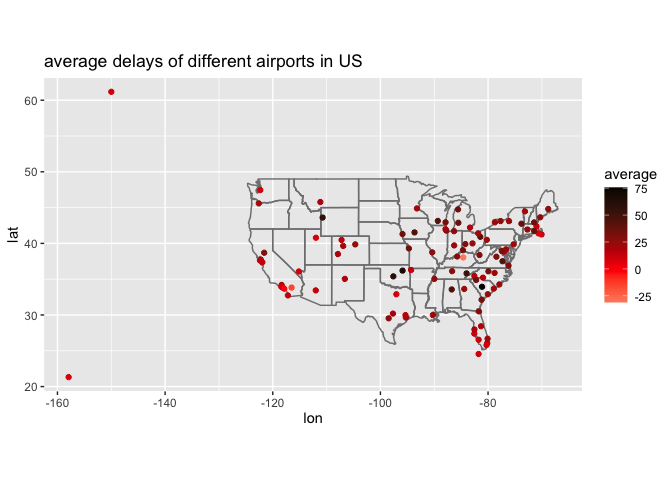

assignment3-433
================
Chenshuo Pan
2022-10-14

\[<https://github.com/cspan6/STAT-433-assignment>\]

``` r
library(nycflights13)
```

    ## Warning: replacing previous import 'lifecycle::last_warnings' by
    ## 'rlang::last_warnings' when loading 'pillar'

``` r
library(dplyr)
```

    ## 
    ## Attaching package: 'dplyr'

    ## The following objects are masked from 'package:stats':
    ## 
    ##     filter, lag

    ## The following objects are masked from 'package:base':
    ## 
    ##     intersect, setdiff, setequal, union

``` r
library(tidyverse)
```

    ## ── Attaching packages ─────────────────────────────────────── tidyverse 1.3.1 ──

    ## ✓ ggplot2 3.3.6     ✓ purrr   0.3.4
    ## ✓ tibble  3.1.6     ✓ stringr 1.4.1
    ## ✓ tidyr   1.1.4     ✓ forcats 0.5.2
    ## ✓ readr   2.1.2

    ## Warning: package 'readr' was built under R version 4.0.5

    ## ── Conflicts ────────────────────────────────────────── tidyverse_conflicts() ──
    ## x dplyr::filter() masks stats::filter()
    ## x dplyr::lag()    masks stats::lag()

``` r
flights = nycflights13::flights
```

``` r
flights_dest = flights%>%
  mutate(total = dep_delay+arr_delay)%>%
  group_by(dest)%>%
  summarize(average = mean(total,na.rm=TRUE))
```

``` r
combined_data<-airports %>%
  semi_join(flights_dest, c("faa" = "dest"))%>%left_join(flights_dest,c("faa" = "dest"))
```

``` r
combined_data%>%
  ggplot(aes(lon, lat,color = average)) +
    borders("state") +
    geom_point() +
    coord_quickmap()+
  ggtitle("average delays of different airports in US")+
  scale_color_gradient2(low = "white", mid = "red", high = "black")
```

<!-- -->
**Question2**

``` r
flights%>%left_join(
airports%>%select(faa,lat,lon),c("dest" = "faa"))%>%
  rename(destlat = lat,destlon = lon)%>%
  left_join(.,select(airports,faa,lat,lon),c("origin" = "faa"))%>%
  rename(orilat = lat,orilon = lon)
```

    ## # A tibble: 336,776 × 23
    ##     year month   day dep_time sched_de…¹ dep_d…² arr_t…³ sched…⁴ arr_d…⁵ carrier
    ##    <int> <int> <int>    <int>      <int>   <dbl>   <int>   <int>   <dbl> <chr>  
    ##  1  2013     1     1      517        515       2     830     819      11 UA     
    ##  2  2013     1     1      533        529       4     850     830      20 UA     
    ##  3  2013     1     1      542        540       2     923     850      33 AA     
    ##  4  2013     1     1      544        545      -1    1004    1022     -18 B6     
    ##  5  2013     1     1      554        600      -6     812     837     -25 DL     
    ##  6  2013     1     1      554        558      -4     740     728      12 UA     
    ##  7  2013     1     1      555        600      -5     913     854      19 B6     
    ##  8  2013     1     1      557        600      -3     709     723     -14 EV     
    ##  9  2013     1     1      557        600      -3     838     846      -8 B6     
    ## 10  2013     1     1      558        600      -2     753     745       8 AA     
    ## # … with 336,766 more rows, 13 more variables: flight <int>, tailnum <chr>,
    ## #   origin <chr>, dest <chr>, air_time <dbl>, distance <dbl>, hour <dbl>,
    ## #   minute <dbl>, time_hour <dttm>, destlat <dbl>, destlon <dbl>, orilat <dbl>,
    ## #   orilon <dbl>, and abbreviated variable names ¹​sched_dep_time, ²​dep_delay,
    ## #   ³​arr_time, ⁴​sched_arr_time, ⁵​arr_delay

**Question3**

``` r
planedata <-planes%>%select(tailnum,year)%>%
rename(planeyear = year)
```

``` r
flights%>%
  left_join(planedata, by = "tailnum")%>% 
  mutate(total = arr_delay + dep_delay) %>%
  group_by(planeyear)%>%
  summarize(mean(total,na.rm = TRUE))
```

    ## # A tibble: 47 × 2
    ##    planeyear `mean(total, na.rm = TRUE)`
    ##        <int>                       <dbl>
    ##  1      1956                        9.45
    ##  2      1959                       14.0 
    ##  3      1963                        9.76
    ##  4      1965                      -20.2 
    ##  5      1967                       14.3 
    ##  6      1968                        8.80
    ##  7      1972                       23.2 
    ##  8      1973                        3.95
    ##  9      1974                       17.5 
    ## 10      1975                       18.1 
    ## # … with 37 more rows

``` r
flights%>%
  mutate(total = arr_delay + dep_delay) %>%
  group_by(tailnum)%>%
  summarize(average = mean(total,na.rm = TRUE))%>%
  left_join(.,planedata, by = "tailnum")%>% 
  filter(!is.na(planeyear))%>%
  group_by(planeyear)%>%
  summarize(average_year = mean(average,na.rm=TRUE))%>%
  ggplot(aes(x = planeyear,y = average_year))+
  geom_point()+
  geom_smooth(method = 'loess',se=F)+
  ggtitle("A scatterplot of average delays for aircraft of different ages")+
  xlab("year of plane")+ylab("average delays")
```

    ## `geom_smooth()` using formula 'y ~ x'

<!-- -->
**About 800 flight numbers can’t find age information**

**Although we may generally think that newer aircraft will be more
punctual, from the scatter plot and the simulated curves, the average
aircraft delay time increased between 1960-2004, while the aircraft in
the 2005-2013 interval increased. The average delay time is decreasing.
There are no huge differences numerically, so no significant trend can
be concluded**
